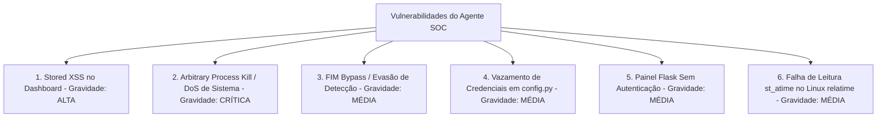

# Relatório de Análise de Segurança — Agente de Segurança SOC

Este documento apresenta uma análise detalhada do projeto **Agente de Segurança SOC**, descrevendo seu funcionamento, sugerindo melhorias arquiteturais e identificando vulnerabilidades críticas de segurança presentes no código atual, juntamente com as respectivas correções recomendadas.

---

## 1. Do que se trata o Projeto?

O **Agente de Segurança SOC** é um agente autônomo de monitoramento de integridade e segurança local (EDR/HIDS básico) integrado com Inteligência Artificial e Threat Intelligence. Ele é projetado para rodar em segundo plano em um sistema (focado em ambientes Linux) e executar as seguintes tarefas:

1. **Monitoramento de Recursos e Conexões:** Coleta uso de CPU, RAM e conexões de rede em tempo real usando a biblioteca `psutil`.
2. **Monitoramento de Integridade de Arquivos (FIM):** Mapeia arquivos em diretórios críticos (como `/etc`, `/tmp`, `/var/log`) criando uma base de comparação (*baseline*) por meio de hashes MD5, identificando modificações ou novos arquivos suspeitos.
3. **Detecção de Acesso a Credenciais:** Monitora arquivos sensíveis (como cookies e dados de login do Chrome, Firefox, Brave, Discord, chaves SSH) e identifica se processos não autorizados acessaram esses arquivos.
4. **Detecção de Processos Suspeitos:** Identifica executáveis rodando a partir de diretórios temporários (`/tmp`, `/dev/shm`), pastas ocultas no *Home* do usuário (`.cache`) ou processos se disfarçando de serviços do sistema (ex: `systemd` rodando fora do caminho padrão).
5. **Threat Intelligence:** Consulta IPs de conexões ativas na API do OTX AlienVault para identificar conexões com servidores maliciosos conhecidos (C2).
6. **Mapeamento MITRE ATT&CK:** Associa os alertas gerados a táticas e técnicas conhecidas do framework MITRE ATT&CK.
7. **Análise por Inteligência Artificial:** Envia o contexto consolidado das métricas e alertas para a API da Groq (usando Llama 3) para obter uma classificação de risco (`BAIXO`, `MÉDIO`, `ALTO`, `CRÍTICO`).
8. **Mitigação Automática:** Caso o risco seja classificado como `ALTO` ou `CRÍTICO`, toma ações defensivas imediatas:
   - Bloqueio do IP suspeito no firewall via `iptables`.
   - Encerramento do processo malicioso (`kill`).
   - Quarentena do arquivo executável suspeito.
9. **Dashboard Web:** Disponibiliza uma interface gráfica básica em Flask (porta 5000) atualizada dinamicamente para exibição do status do sistema e alertas recentes.

---

## 2. Pontos de Melhoria Geral

Embora a proposta do projeto seja excelente, existem diversas melhorias arquiteturais e operacionais que podem ser implementadas:

### A. Monitoramento em Tempo Real (Event-Driven)
* **Problema atual:** O agente realiza buscas periódicas ativas (*polling*) a cada 1 minuto (caminhando por diretórios inteiros via `os.walk` e verificando metadados de arquivos). Isso causa alta sobrecarga de CPU e I/O de disco.
* **Melhoria:** Utilizar monitoramento baseado em eventos do kernel do sistema operacional.
  - No Linux, pode-se usar **`inotify`** (através da biblioteca `watchdog` em Python) para detectar criação, modificação ou leitura de arquivos em milissegundos, eliminando a necessidade de *loops* pesados de varredura.

### B. Uso de Variáveis de Ambiente (`.env`)
* **Problema atual:** O arquivo `config.py` armazena chaves privadas de API (`GROQ_API_KEY`, `OTX_API_KEY`) diretamente em texto puro. Isso facilita o vazamento acidental destas credenciais se o arquivo for enviado a repositórios como o GitHub.
* **Melhoria:** Adotar a biblioteca `python-dotenv` para ler chaves de um arquivo `.env` (adicionado ao `.gitignore`).

### C. Estruturação dos Alertas (Event Schema)
* **Problema atual:** Os alertas trafegam pelo sistema como strings brutas de texto plano (ex: `"ARQUIVO NOVO: /tmp/arquivo.sh"`). Isso força os módulos de mitigação a usarem expressões regulares (Regex) frágeis para extrair caminhos de arquivos, IPs e PIDs, abrindo brechas para falhas lógicas graves.
* **Melhoria:** Modelar os alertas como objetos estruturados (dicionários ou classes dataclass) que carregam metadados explícitos:
  ```python
  {
      "tipo": "processo_suspeito",
      "mensagem": "Processo suspeito detectado",
      "pid": 1234,
      "caminho": "/tmp/processo",
      "ip": "198.51.100.2"
  }
  ```

### D. Compatibilidade Multiplataforma
* **Problema atual:** O código possui forte dependência de utilitários específicos do Linux (como `/tmp`, `/dev/shm`, comando `sudo iptables` e caminhos como `~/.config/discord`). Ele falhará ou apresentará erros se executado em ambientes Windows ou macOS.
* **Melhoria:** Adicionar checagens dinâmicas de sistema operacional (`sys.platform`) e isolar as ações de mitigação e caminhos monitorados por OS.

---

## 3. Vulnerabilidades de Segurança Identificadas

Abaixo estão listadas as vulnerabilidades de segurança encontradas no código, classificadas por gravidade.



---

### Vulnerabilidade 1: Stored XSS (Cross-Site Scripting) no Dashboard Flask
* **Gravidade:** Alta
* **Arquivo afetado:** [dashboard.py](file:///c:/agente-seguranca-soc/dashboard.py#L130-L142)
* **Descrição:** 
  O dashboard renderiza os alertas recebidos inserindo-os diretamente no DOM via `innerHTML` sem realizar qualquer sanitização ou codificação de entidades HTML. 
  ```javascript
  const alertasTexto = Array.isArray(e.alertas) ? e.alertas.join('<br>') : e.alertas;
  return `
  <div class="alerta ${nivel}">
      ...
      <br><br>${alertasTexto}
      ...
  </div>`;
  ```
  Se um atacante criar um arquivo com nome malicioso em um diretório monitorado, como:
  `/tmp/`
  O agente detectará o arquivo novo e enviará a string do nome para o dashboard. Quando o analista abrir a página web, o script injetado será executado no navegador dele.

---

### Vulnerabilidade 2: Negação de Serviço (DoS) e Encerramento Arbitrário de Processos Críticos
* **Gravidade:** Crítica
* **Arquivo afetado:** [mitigacao.py](file:///c:/agente-seguranca-soc/mitigacao.py#L151-L156)
* **Descrição:** 
  A mitigação automática tenta extrair o PID de processos suspeitos a partir da mensagem textual do alerta usando Regex:
  ```python
  if 'processo' in alerta_lower and 'suspeito' in alerta_lower and 'pid' in alerta_lower:
      pids = re.findall(r'pid\s+(\d+)', alerta_lower)
      for pid in pids:
          resultado = matar_processo(int(pid))
  ```
  Se um invasor criar um arquivo ou processo cuja string do nome contenha palavras-chave específicas e um número arbitrário de PID, o agente poderá ser induzido a encerrar processos cruciais do próprio sistema operacional.
  **Exemplo de Ataque:**
  Um arquivo executável é criado com o nome: `/tmp/processo_suspeito_pid 1.sh`
  O alerta gerado será:
  `⛔ CRÍTICO — EXECUTÁVEL EM LOCAL SUSPEITO: /tmp/processo_suspeito_pid 1.sh`
  O texto do alerta atende a todas as condições (`processo`, `suspeito`, `pid`). O Regex extrairá o número `1` (do trecho `pid 1.sh`).
  O agente então chamará `matar_processo(1)`. O **PID 1** é o processo de inicialização do Linux (`systemd`/`init`). Derrubá-lo causará um travamento imediato e catastrófico do sistema operacional (*Kernel Panic*).

---

### Vulnerabilidade 3: Evasão no Monitoramento de Integridade (FIM Bypass)
* **Gravidade:** Média
* **Arquivo afetado:** [agente.py](file:///c:/agente-seguranca-soc/agente.py#L55-L62)
* **Descrição:**
  A função `calcular_hash` foi implementada de forma a ler apenas os primeiros 8192 bytes (8 KB) do arquivo:
  ```python
  def calcular_hash(caminho):
      try:
          h = hashlib.md5()
          with open(caminho, 'rb') as f:
              h.update(f.read(8192))
          return h.hexdigest()
  ```
  Se um atacante modificar um script ou executável de sistema (por exemplo, em `/etc`) alterando linhas de código localizadas após o byte 8192, o hash retornado pelo agente continuará sendo o mesmo do baseline.
  Além disso, o uso de MD5 é desencorajado para fins de segurança criptográfica devido à possibilidade de colisões de hash.

---

### Vulnerabilidade 4: Armazenamento Inseguro de Segredos (Hardcoded API Keys)
* **Gravidade:** Média
* **Arquivo afetado:** `config.py` (Conforme indicado no `README.md`)
* **Descrição:**
  Chaves sensíveis de acesso para a API da Groq e AlienVault OTX são mantidas estaticamente em um arquivo de código fonte (`config.py`). Isso viola as melhores práticas de desenvolvimento seguro (OWASP Top 10 - Cryptographic Failures / Insecure Configuration).

---

### Vulnerabilidade 5: Exposição do Dashboard Sem Autenticação e Ligado a Interfaces Externas
* **Gravidade:** Média
* **Arquivo afetado:** [dashboard.py](file:///c:/agente-seguranca-soc/dashboard.py#L182)
* **Descrição:**
  A aplicação Flask executa escutando em `0.0.0.0` (todas as interfaces de rede disponíveis):
  ```python
  app.run(host='0.0.0.0', port=5000, debug=False)
  ```
  Como não há controle de acesso, qualquer pessoa na mesma rede local (ou na internet, se a porta estiver exposta) poderá visualizar o dashboard do SOC, monitorar o uso de recursos do servidor, ler os logs de alertas de segurança detalhados e ter visibilidade sobre os pontos vulneráveis detectados.

---

### Vulnerabilidade 6: Ineficácia do Detector de Acesso a Tokens sob `relatime` no Linux
* **Gravidade:** Média (Falha Lógica)
* **Arquivo afetado:** [detector_tokens.py](file:///c:/agente-seguranca-soc/detector_tokens.py#L51)
* **Descrição:**
  O detector usa `st_atime` (data do último acesso ao arquivo) para verificar se programas leram os cookies de sessão ou chaves SSH:
  ```python
  if agora - ultimo_acesso < 30:
  ```
  Por padrão, a maioria das distribuições Linux modernas monta os sistemas de arquivos usando a opção **`relatime`** por motivos de performance. Sob a política `relatime`, o tempo de acesso (`atime`) só é atualizado em disco se o arquivo foi modificado recentemente ou se o último acesso ocorreu há mais de 24 horas. Portanto, leituras puras de credenciais efetuadas por spywares passarão completamente despercebidas pelo agente.

---

## 4. Como Corrigir as Vulnerabilidades (Plano de Mitigação)

### Correção 1: Sanitização contra XSS no Dashboard
Substituir o uso de `innerHTML` direto por uma função de codificação de entidades HTML no script do [dashboard.py](file:///c:/agente-seguranca-soc/dashboard.py).

* **Código de correção sugerido para a seção `<script>` do Dashboard:**
```javascript
function escapeHTML(str) {
    if (!str) return '';
    return str.toString()
        .replace(/&/g, '&amp;')
        .replace(/</g, '&lt;')
        .replace(/>/g, '&gt;')
        .replace(/"/g, '&quot;')
        .replace(/'/g, '&#39;');
}

// Ao construir a string do HTML:
const alertasTexto = Array.isArray(e.alertas) 
    ? e.alertas.map(a => escapeHTML(a)).join('<br>') 
    : escapeHTML(e.alertas);

const analiseTexto = escapeHTML(e.analise);
```

---

### Correção 2: Mitigação Baseada em Dados Estruturados e Proteção do PID 1
Reestruturar o fluxo de alertas no agente para que ele passe dicionários estruturados em vez de textos genéricos, e aplicar uma lista negra de proteção de PIDs vitais no [mitigacao.py](file:///c:/agente-seguranca-soc/mitigacao.py).

* **Passo A: Definir um dicionário estruturado para os alertas**
Em `agente.py`, em vez de apenas strings nas listas de alertas, retorne dicionários com metadados:
```python
# Exemplo em detector_processos.py
alertas.append({
    "tipo": "processo_suspeito",
    "mensagem": f"Processo '{nome}' rodando de local suspeito",
    "pid": pid,
    "caminho": exe
})
```

* **Passo B: Tratar os PIDs e proteger PIDs críticos em `mitigacao.py`**
```python
PIDS_PROTEGIDOS = [0, 1, 2] # PIDs do Kernel e Init (systemd)

def matar_processo(pid):
    # Proteção explícita
    if pid in PIDS_PROTEGIDOS or pid == os.getpid():
        return f"⚠️ Bloqueado: Tentativa ilegal de encerrar processo protegido (PID {pid})"
    try:
        proc = psutil.Process(pid)
        nome = proc.name()
        proc.kill()
        return f"✅ Processo encerrado: {nome} (PID {pid})"
    except Exception as e:
        return f"❌ Erro ao encerrar processo: {e}"
```

---

### Correção 3: Leitura Completa de Arquivos no FIM e Transição para SHA-256
Ajustar a função `calcular_hash` em [agente.py](file:///c:/agente-seguranca-soc/agente.py) para ler o arquivo em blocos até o final (EOF) e atualizar para SHA-256.

```python
def calcular_hash(caminho):
    try:
        h = hashlib.sha256()
        with open(caminho, 'rb') as f:
            while True:
                bloco = f.read(65536) # Leitura eficiente em blocos de 64KB
                if not bloco:
                    break
                h.update(bloco)
        return h.hexdigest()
    except Exception:
        return None
```

---

### Correção 4: Uso de Variáveis de Ambiente e Arquivo `.env`
Mudar a importação de configurações sensíveis para leitura de variáveis de ambiente.

1. Instalar dependência: `pip install python-dotenv`
2. Criar um arquivo `.env` na raiz do projeto:
   ```env
   GROQ_API_KEY="sua_chave_groq"
   OTX_API_KEY="sua_chave_otx"
   ```
3. Ler essas variáveis no `config.py`:
   ```python
   import os
   from dotenv import load_dotenv

   load_dotenv()

   GROQ_API_KEY = os.getenv("GROQ_API_KEY")
   OTX_API_KEY = os.getenv("OTX_API_KEY")
   # Restante das configurações...
   ```

---

### Correção 5: Restringir Acesso ao Dashboard (Bind Local)
Por padrão, escutar apenas em `127.0.0.1` (localhost). Se o acesso remoto for necessário, ele deve passar por autenticação ou túnel seguro SSH (Port Forwarding).

No arquivo [dashboard.py](file:///c:/agente-seguranca-soc/dashboard.py):
```python
if __name__ == '__main__':
    # Altera para localhost
    app.run(host='127.0.0.1', port=5000, debug=False)
```

---

### Correção 6: Uso de `inotify` no Linux para Arquivos Sensíveis
Para detectar vazamento e roubo de tokens em tempo real de forma eficaz, substitua a validação periódica baseada em `st_atime` pela escuta ativa do subsistema `inotify` do Linux.

Instale a biblioteca `watchdog` e registre um monitor permanente sobre os arquivos de tokens de sessão. Dessa forma, qualquer evento `on_opened` ou `on_modified` será interceptado instantaneamente, independentemente das opções de montagem da partição (`relatime`/`noatime`).
